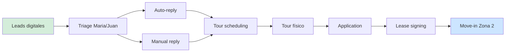

# Business Map Template — Paso 2 del audit

Mapa de la empresa como sistema de flujos de valor. Output visual + documento.

## Filosofía

> No mapeamos el organigrama — mapeamos el dinero y la información en movimiento.

## Estructura canónica

Toda empresa se mapea en 4 zonas:

```
   1. Adquisición  →  2. Entrega  →  3. Retención  →  4. Back-office
   (Revenue IN)      (Valor OUT)      (LTV)            (Costo operativo)
```

### Zona 1 — Adquisición
Todo lo que convierte desconocidos en clientes.
- Marketing (SEO, paid, content, eventos).
- Sales (outbound, inbound, partnerships).
- Onboarding de leads hasta firma.

### Zona 2 — Entrega
El trabajo real que convierte la promesa en producto/servicio.
- Onboarding del cliente.
- Operaciones core.
- Fulfillment / entrega.
- Calidad / QA.

### Zona 3 — Retención
Todo lo que mantiene al cliente pagando / renovando.
- Support.
- Customer Success.
- Upsell / cross-sell.
- Renewals.

### Zona 4 — Back-office
Todo lo que sostiene al resto.
- Finanzas / accounting.
- HR / gente.
- Legal / compliance.
- IT / tech.

---

## Plantilla de captura por zona

Por cada zona, llenar:

```
### Zona: {{nombre}}

**Propósito:** {{1 frase}}
**Sponsor:** {{rol}}
**KPIs que se miden:**
- {{métrica 1}} — baseline: {{valor}}
- {{métrica 2}} — baseline: {{valor}}

**Procesos principales:**
1. {{proceso}} — {{descripción 1 línea}}
2. ...

**Sistemas / software:**
- {{nombre}} — {{uso}} — {{sentimiento del equipo: 🟢/🟡/🔴}}

**Personas clave:**
- {{nombre}} ({{rol}}) — {{responsabilidad}}

**Handoffs (entrada y salida):**
- Entra de: {{zona anterior}} ({{qué)}}
- Sale a: {{zona siguiente}} ({{qué}})

**Dolor reportado (de entrevistas):**
- {{dolor 1}} — {{quién lo reportó}}
- ...

**Automation existente:**
- {{qué ya está automatizado}}
```

---

## Ejemplo — Property Management (400 unidades)

### Zona 1: Adquisición

**Propósito:** Convertir búsquedas de vivienda en tours agendados y contratos firmados.
**Sponsor:** Director of Sales & Marketing.
**KPIs:**
- Leads/mes: 420
- Time-to-first-touch: 3.2 h
- Lead-to-tour: 18%
- Tour-to-lease: 28%

**Procesos:**
1. Captura de leads (web forms, Zillow, Apartments.com).
2. Triage y ruteo (manual, por Maria y Juan).
3. Primer contacto (email + SMS).
4. Tour scheduling (calendario Calendly).
5. Tour physical / virtual.
6. Application review.
7. Lease signing (DocuSign).

**Sistemas:**
- AppFolio — CRM + PMS — 🟡 (funciona pero duplica datos)
- Zillow / Apartments.com — sources — 🟢
- Calendly — scheduling — 🟢
- DocuSign — firmas — 🟢
- Excel — tracking paralelo — 🔴

**Personas:**
- Maria (Leasing Specialist) — triage y primer contacto
- Juan (Leasing Specialist) — triage y primer contacto
- Karen (Director Sales) — escalamiento y cierre

**Handoffs:**
- Entra de: Marketing (leads digitales).
- Sale a: Zona 2 Entrega (contrato firmado → move-in).

**Dolor:**
- "Cuando entran 20 leads a la vez, pierdo 3-4 porque no alcanzo a responder" (Maria).
- "Veo en Excel cuando un lead ya fue mirado 2 veces, en AppFolio no" (Juan).
- "La conversión varía 40% entre Maria y Juan; no sé por qué" (Karen).

**Automation existente:**
- Auto-reply básico de AppFolio (pero genérico).
- Notif de calendar por Calendly.

---

## Diagrama visual

### Herramientas recomendadas
- **Excalidraw** (rápido, compartible).
- **Miro** (si el cliente ya tiene licencia).
- **Paperclip canvas** (si está activo).
- **Mermaid** (versionable en git).

### Mermaid (ejemplo)



---

## Reglas de mapeo

1. **Un proceso por bloque.** Si un bloque tiene 5 subprocesos, abrirlos.
2. **Todo handoff visible.** Si dos personas intercambian data, es un nodo.
3. **Sistemas en los bordes del bloque.** No ocultar qué software toca cada paso.
4. **Dolor capturado in situ.** Quote del operador vinculado al nodo.

---

## Cómo validar el mapa

### Sesión de validación con el sponsor

Duración: 45 minutos.

1. Presentar el mapa zona por zona.
2. Por cada zona preguntar:
   - ¿Falta algún proceso?
   - ¿Está mal nombrado algo?
   - ¿Falta algún sistema?
3. Marcar los handoffs "problemáticos" en rojo.
4. Sponsor firma (verbal / email) la versión 1.

Si el sponsor aporta correcciones, iterar y volver a validar con el dueño de cada zona.

---

## Output final

Archivo: `/delivery/clients/{{company}}/business-map-v1.md` + PNG exportado del diagrama.

Estructura del MD:
```
# Business Map — {{company}}
Versión: 1.0 · Fecha: {{date}}

## Zona 1: Adquisición
[estructura completa]

## Zona 2: Entrega
[estructura completa]

## Zona 3: Retención
[estructura completa]

## Zona 4: Back-office
[estructura completa]

## Handoffs críticos (top 5)
1.
2.

## Sistemas críticos
| Sistema | Zonas | Criticidad |
|---|---|---|

## Personas clave
| Nombre | Rol | Zonas | Riesgo single point of failure |
|---|---|---|---|
```

---

## Uso downstream

El business map sirve para:
- Ubicar cada tarea del task map en su zona.
- Visualizar handoffs con más fricción (foco del audit).
- Mostrar al sponsor "esto es tu empresa" (validación).
- Slide visual en el deck final.
- Template para futuras revisiones anuales.

## Referencias

- Paso previo: `/audit/outcome-definition.md`
- Paso siguiente: `/audit/task-map-template.md`
